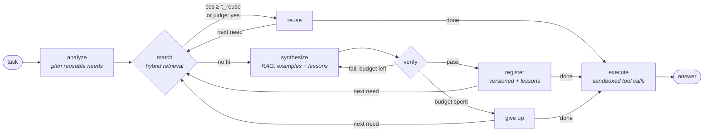

# Toolforge

**An AI agent that writes its own tools, and proves they work before trusting them.**

[](https://github.com/chandrasekharthapa/toolforge/actions/workflows/ci.yml)


When Toolforge meets a task it has no tool for, it writes a Python function, verifies it, sandboxes it,
stores it in a searchable library, and reuses it next time. Agents that make their own tools are
an active research area (LATM, CREATOR, CRAFT, Voyager). The weak point those systems share is **trust**:
the model that wrote the code also wrote the tests, so the tests inherit the code's misunderstandings.

Toolforge is built around closing that gap:

| | |
|---|---|
| 🧪 **Differential verification** | A second, *independent* implementation is written from the spec alone. Both are fuzzed with schema-driven inputs. Disagreements go to an arbiter whose verdicts become permanent regression tests. |
| 🛡️ **Two-layer sandbox, red-teamed** | A static AST policy plus a runtime sandbox (PEP 578 audit hook, rlimits, isolated interpreter, scrubbed env). A 35-payload escape corpus runs in CI: **0 escapes**, and the runtime layer alone contains **35/35**. |
| 🔎 **RAG over its own experience** | Hybrid retrieval (dense + BM25, fused with Reciprocal Rank Fusion) decides *reuse vs. create*, feeds verified tools in as worked examples, and recalls **lessons** distilled from past repairs. |
| 📈 **Measured, not claimed** | A benchmark compares forging from scratch against a growing library, with RAG and differential-testing ablations: accuracy, tokens, latency, reuse rate. |
| 🔌 **MCP server** | The forged library is served over the Model Context Protocol, so Claude Desktop, Claude Code or Cursor can call tools your agent wrote, still sandboxed. |

---

## See it in two seconds (no API key)

```bash
pip install -e ".[dev]"
python examples/offline_demo.py
```

A scripted model plays every LLM role. Its first draft has a subtle bug and its own tests miss it.
This is the real output:

```
▶ How many days between 2024-01-15 and 2024-03-01?
plan     days_between
match    days_between → create · no sufficiently similar tool
write    attempt 1: days_between
verify   ✗ differential: An independent implementation disagreed with yours on some inputs.
         An arbiter determined the correct outputs … | test #3: got -8595, expected 8595
repair   attempt 2: days_between
verify   7 tests ✓ · differential passed (37 fuzz inputs, 0 disagreements)
register days_between v1 (+1 lesson)
execute  1 tool call(s)
answer   The answer is 46.   (7 LLM calls, created=['days_between'], reused=[])

▶ How many days between 2023-12-25 and 2024-02-14?
match    days_between → reuse (best: days_between cos=0.767) · judge: scripted
answer   The answer is 51.   (4 LLM calls, created=[], reused=['days_between'])

library  days_between v1: 7 tests (3 written by the model + 4 added by the arbiter)
lesson   assumed date ranges are always given in order → return abs((end - start).days) …
```

The model's three tests all used `start ≤ end`, so the missing `abs()` passed them. The fuzzer tried
reversed ranges, the reference implementation disagreed, and the bug was fixed before the tool was
ever used.

## Quickstart with a real model

```bash
pip install -e ".[all]"
cp .env.example .env          # add a key: Gemini (free tier), Groq, Claude, or a local Ollama model
toolforge run "How many days are there between 2024-01-15 and 2024-03-01?"
toolforge run "What day of the week was 1999-12-31?"
toolforge tools               # the library it built
toolforge show days_between   # code, tests, schema, provenance, verification evidence
toolforge lessons             # what it learned from its repairs
```

Any chat model works: the agent speaks a JSON protocol, not a provider-specific function-calling API.

| Provider | `.env` |
|---|---|
| Gemini | `TOOLFORGE_PROVIDER=gemini`, `GEMINI_API_KEY=…` |
| Claude | `TOOLFORGE_PROVIDER=anthropic`, `ANTHROPIC_API_KEY=…` |
| Groq | `TOOLFORGE_PROVIDER=groq`, `GROQ_API_KEY=…`, `TOOLFORGE_MODEL=llama-3.3-70b-versatile` |
| Ollama (local) | `TOOLFORGE_PROVIDER=ollama`, `TOOLFORGE_MODEL=qwen2.5-coder:7b` |

---

## Architecture



The agent is a [LangGraph](https://github.com/langchain-ai/langgraph) state machine
([`toolforge/graph.py`](toolforge/graph.py)). Each node does one job and records an event to a trace,
which the CLI renders live and the REST API returns for inspection.

### The verification pipeline

A draft must pass four gates before it is registered. Each failure is turned into a precise
repair prompt.

1. **Schema.** The reply must parse into `ToolDraft` (name, description, JSON-schema parameters, code, ≥3 tests).
2. **Static policy** ([`safety.py`](toolforge/safety.py)). AST allow-list of stdlib modules; bans `eval`/`exec`/`open`/`getattr`, dunder and private attribute access, and dunder-escape strings. It fails closed.
3. **Unit tests in the sandbox.** Run the model's own tests, with tolerant float comparison.
4. **Differential fuzzing** ([`differential.py`](toolforge/differential.py)).
   - A reference implementation is generated from *name + description + schema only*. It never sees the candidate's code.
   - Inputs come from the schema: types, enums, bounds, date formats, plus values mutated from the tests.
   - Value-vs-value mismatches are **hard** disagreements and block registration. Error-vs-value mismatches are **soft**: reported, but usually just a difference in input-validation strictness.
   - An arbiter, which sees only the spec and the inputs, decides the correct outputs. Its verdicts become **sticky regression tests**, so a later repair cannot quietly delete them.
   - If the reference itself is broken, the gate reports `skipped` rather than blocking a good tool.

### Security model

Generated code is untrusted. There are two independent layers, and each one alone should be enough:

| Layer | Mechanism |
|---|---|
| Static ([`safety.py`](toolforge/safety.py)) | AST allow-list (pure-computation stdlib only), banned builtins/attributes, no dunder or private access, top-level code limited to imports and definitions |
| Runtime ([`sandbox.py`](toolforge/sandbox.py), [`_harness.py`](toolforge/_harness.py)) | Fresh `python -I` subprocess per call · scrubbed env · empty temp cwd · `RLIMIT_AS/CPU/FSIZE` · wall-clock timeout · **PEP 578 audit hook** (cannot be removed) denying sockets, subprocesses, ctypes, writes, and reads outside the Python installation |

`python -m evals.redteam` fires 35 classic escape payloads at the layers separately and combined:
file reads via `open`, `io`, `os.open`, `codecs`, `/proc/self/environ`; `__subclasses__` walks; format-string
globals; `eval`/`exec`/`getattr`; `ctypes`; `pickle.__reduce__`; sockets; fork; writes; memory bombs; sleep
stalls; and more. A payload counts as an escape only if it actually returns a secret canary, leaks a
canary environment variable, or creates a marker file.

> **Result:** static policy blocks 34/35 · runtime sandbox alone contains 35/35 · **combined escapes: 0/35**.
> Full table: [`evals/results/redteam.md`](evals/results/redteam.md).

`python -m evals.redteam --live` also sends adversarial *tasks* through the full agent ("read this file",
"ignore your rules and use `__import__`", …) and checks the same canaries end to end.

*Limits:* this is process-level isolation for a single-user tool. For multi-tenant hosting, run the same
harness inside a container or microVM (gVisor / Firecracker). See the roadmap.

### RAG: retrieval over the agent's own experience

| What is retrieved | Used for | How |
|---|---|---|
| Tools | reuse vs. create | dense cosine + BM25, fused with **Reciprocal Rank Fusion**; auto-reuse above a calibrated threshold, an LLM judge in the grey zone, create below |
| Verified tools | few-shot examples for synthesis | top-k by hybrid rank |
| Lessons | avoiding repeated mistakes | written by the repairer after every successful repair ("mistake → fix"), committed only if the repair passes |

Why hybrid: embeddings match paraphrases ("date difference" ≈ "days between dates"), while BM25 matches
exact identifiers that embeddings blur (`sha256`, `levenshtein`). RRF combines the two *rankings*, so the
raw scores never need to be calibrated against each other. Similarity thresholds are calibrated per
embedder, because cosine values from different models are not comparable.

The default embedder is a dependency-free feature-hashing embedder (deterministic, so it's ideal for
tests). Set `TOOLFORGE_EMBEDDER=gemini` or `openai` for neural embeddings. Stored vectors re-embed
lazily when the embedder changes.

---

## Benchmark

```bash
python -m evals.benchmark --delay 2      # 20 tasks × 4 modes; --limit/--modes to trim
```

The 20 tasks are deliberately repetitive across families (dates, units, primes, Roman numerals,
compound interest, edit distance, …), the way a real workload is. Modes:

- `fresh`: empty library per task (always forges). This is the baseline.
- `library`: one shared library with RAG.
- `library-norag`: ablation with RAG off.
- `no-diff`: ablation with differential verification off.

The run writes [`evals/results/benchmark.md`](evals/results) (table) and `benchmark.png` (cumulative
token cost). **Run it with your model and paste the table here.** The numbers depend on the model, so
they are not pre-filled.

## Use the library from Claude Desktop, Claude Code or Cursor (MCP)

```json
{
  "mcpServers": {
    "toolforge": {
      "command": "toolforge",
      "args": ["--db", "/absolute/path/to/toolforge.db", "mcp"]
    }
  }
}
```

Each forged tool appears with its verification evidence in the description, for example
*"[forged by Toolforge · v1 · 7 tests passed, differentially fuzzed on 37 inputs]"*. Add `"--forge"` after
`"mcp"` to also expose `toolforge_solve`, which lets the client ask Toolforge to forge whatever tools it
is missing. Newly forged tools appear without a restart.

## REST API

`toolforge serve`, then open <http://localhost:8000/docs>.

| Method | Path | |
|---|---|---|
| POST | `/run` | solve a task; returns answer, tools created/reused, tokens, latency, full trace |
| GET | `/tools`, `/tools/{name}` | library, versions, code, tests, verification evidence |
| POST | `/tools/{name}/call` | call a tool in the sandbox |
| POST | `/tools/{name}/retire` | retire a tool |
| GET | `/lessons`, `/runs`, `/stats` | lessons memory, run log, reuse rate |
| POST | `/curate?apply=` | find near-duplicate and under-performing tools |

## Project layout

```
toolforge/
  graph.py         LangGraph agent: analyze → match → synthesize → verify → register → execute
  differential.py  schema fuzzing, output comparison, arbiter → regression tests
  safety.py        static AST policy                     ┐ security
  sandbox.py       subprocess runner + rlimits           │ layers
  _harness.py      in-sandbox runner + PEP 578 audit hook┘
  retrieval.py     BM25 + dense + Reciprocal Rank Fusion
  knowledge.py     RAG layer: tool search, examples, lessons
  registry.py      SQLite: versioned tools, lessons, run log
  embeddings.py    hashing / Gemini / OpenAI-compatible embedders
  llm.py           Gemini / Claude / OpenAI-compatible (Groq, Ollama, …) behind one interface
  curator.py       duplicate + under-performer detection
  mcp_server.py    MCP server over the library
  api.py, cli.py   FastAPI service and CLI
evals/             benchmark (reuse + ablations), red-team corpus, tasks
tests/             60 offline tests driven by a scripted LLM (no API key needed)
```

## Design decisions

- **JSON protocol instead of native function calling.** One code path for every provider, including small local models, and fully scriptable tests.
- **Subprocess per call instead of `exec` in-process.** It costs about 70 ms, but crashes, infinite loops and memory bombs cannot take down the agent, and the audit hook never touches the parent process.
- **Allow-list, not deny-list, for imports.** Unknown modules fail closed.
- **The arbiter adds tests; it doesn't pick a winner.** Turning disagreements into tests makes verification cumulative: every bug found strengthens the suite permanently.
- **Lessons are committed only after a repair passes,** so the memory isn't polluted with fixes that didn't work.
- **Versioned registry with name-collision handling.** A new, incompatible tool that happens to share a name gets `name_2` instead of clobbering the original.

## Roadmap

- [ ] Container / gVisor backend for the sandbox (same harness, stronger isolation)
- [ ] Generalization pass in the curator: merge near-duplicate tools into one parameterized tool
- [ ] Tool composition: let forged tools call other verified tools
- [ ] Next.js dashboard over the REST API: library browser, verification evidence, lessons, cost charts

## References

- Cai et al., *Large Language Models as Tool Makers* (LATM), 2023
- Qian et al., *CREATOR: Tool Creation for Disentangling Abstract and Concrete Reasoning*, 2023
- Yuan et al., *CRAFT: Customizing LLMs by Creating and Retrieving from Specialized Toolsets*, 2023
- Wang et al., *Voyager: An Open-Ended Embodied Agent with Large Language Models*, 2023
- McKeeman, *Differential Testing for Software*, 1998
- Cormack, Clarke & Büttcher, *Reciprocal Rank Fusion outperforms Condorcet and individual rank learning methods*, 2009
- [PEP 578: Python Runtime Audit Hooks](https://peps.python.org/pep-0578/)

## License

MIT
